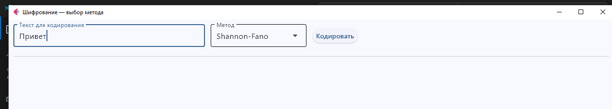
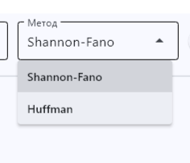
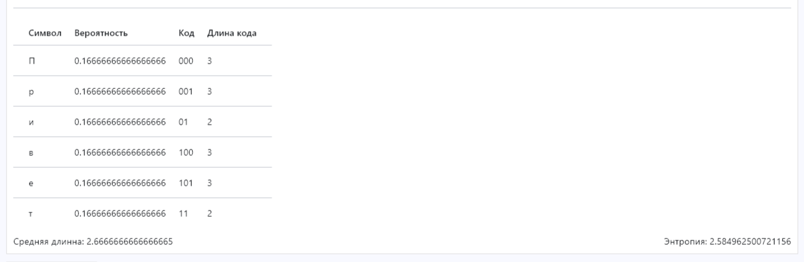
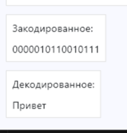

  

Простое Flet-приложение для демонстрации построения префиксных кодов Shannon–Fano и Huffman,
их использования для кодирования/декодирования текста и вывода статистики.

  

## Что делает проект

-Принимает текст от пользователя.



-Позволяет выбрать алгоритм кодирования: Shannon-Fano или Huffman.



-Строит таблицу частот символов и соответствующие коды.



-Кодирует и декодирует строку.




  

## Требования

- Python 3.8+

- Установленные зависимости (файл requirements.txt в корне проекта).
````bash
pip install -r requirements.txt
````


